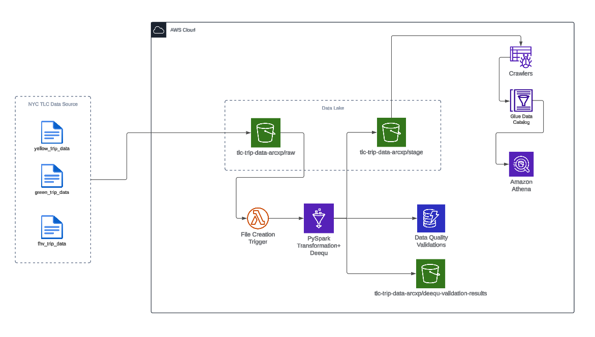
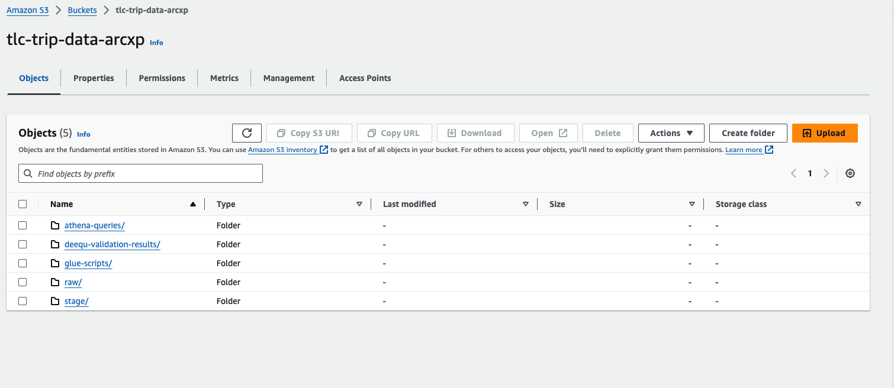
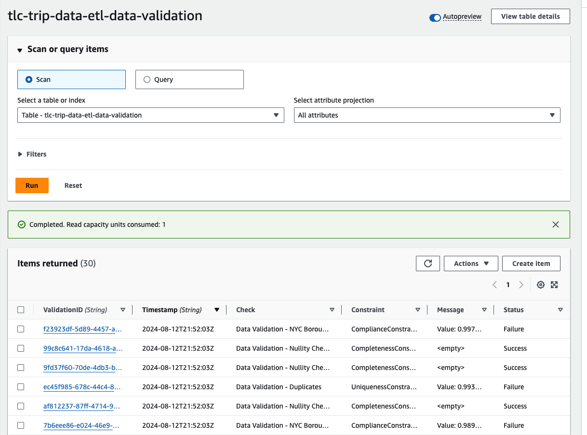
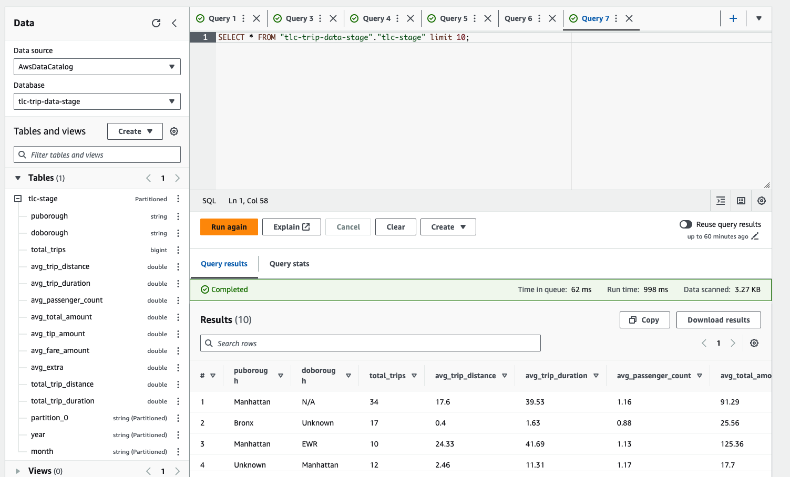
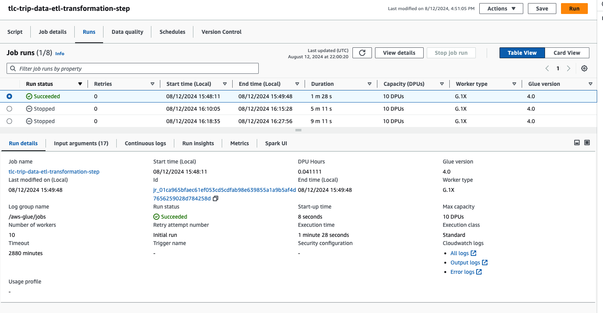
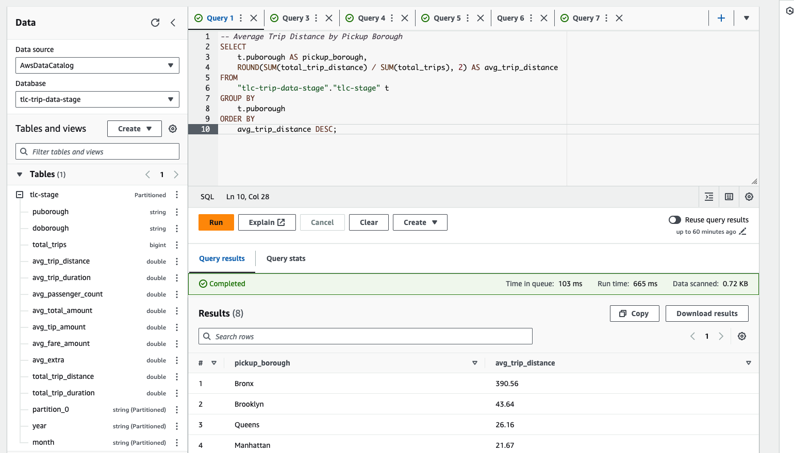
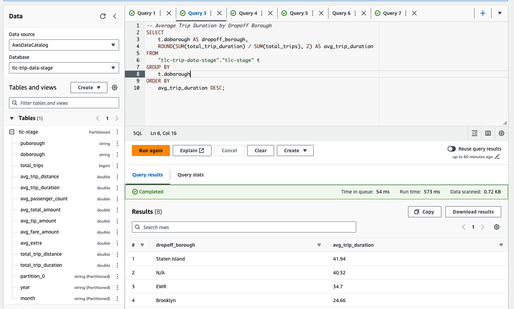
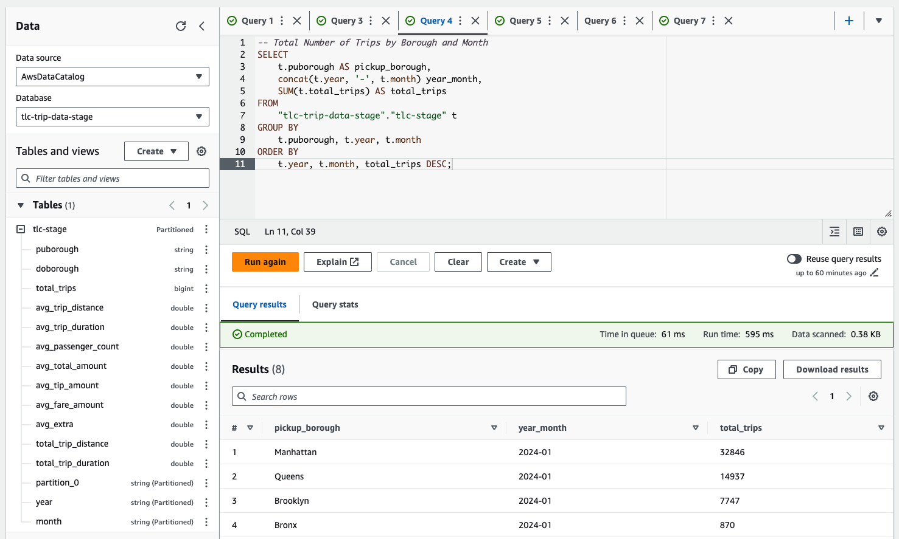
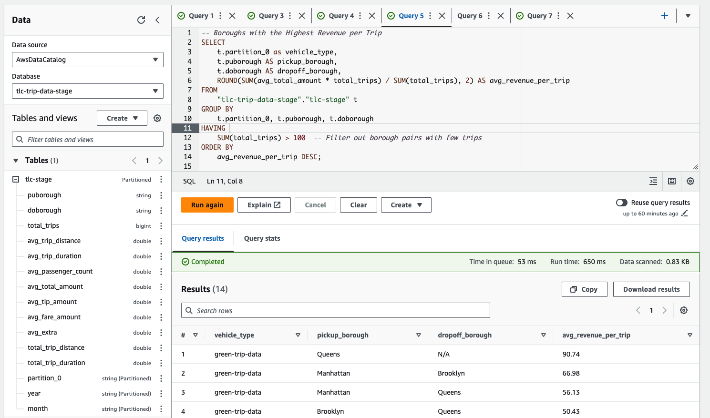

# NYC Taxi Data ETL Pipeline

## Overview

This ETL pipeline processes NYC taxi trip data, loads it into an S3 bucket, and catalogs it using AWS Glue. The data is then queried in Amazon Athena to generate insights such as average trip distance by borough, total number of trips, and other key metrics.

For more information about the dataset go to this website: [Website Link](https://www.nyc.gov/site/tlc/about/tlc-trip-record-data.page)


## Prerequisites

Before you begin, ensure you have the following:

- **AWS Account**: An AWS account with necessary permissions to create resources in S3, Glue, Athena, and IAM.

### Required Permissions

Ensure that the IAM role associated with AWS Glue and other AWS resources has the following permissions:

- S3: `s3:GetObject, s3:PutObject`
- DynamoDB: `dynamodb:GetItem, dynamodb:PutItem`
- Glue: `AWSGlueServiceRole`
- Customer inline policy to assume role for glue jobs: Pass Role IAM for Glue Jobs

```
{
    "Version": "2012-10-17",
    "Statement": [
        {
            "Effect": "Allow",
            "Action": "iam:PassRole",
            "Resource": "arn:aws:iam::*"
        }
    ]
}
```

## Architecture Overview

This pipeline consists of the following components:

1. **Data Ingestion**: Monthly NYC taxi trip data is uploaded to an S3 bucket, partitioned by year and month on **Raw Layer**, `s3://tlc-trip-data-arcxp/raw/{trip_type}/year={year}/month={month}/`.
2. **AWS Glue ETL Jobs**: Processes the data (e.g., filtering, aggregating) and stores the transformed data back into **Stage Layer**, `s3://tlc-trip-data-arcxp/stage/{trip_type}/year={year}/month={month}/`. Also, performed Deequ constraints checks and store the results in DynamoDB Table `tlc-trip-data-etl-data-validation
`
3. **AWS Glue Crawler**: Scans the S3 bucket on the **Stage Layer**, updates the Glue Data Catalog with new partitions and schema changes.
4. **Amazon Athena**: Queries the data stored in S3 using the **Data Catalog** generated on **3rd step** to generate insights.
5. **CloudWatch**: Monitors the ETL jobs.

### Additional components
- S3 path for temporary storage of athena queries: `s3://tlc-trip-data-arcxp/athena-queries/`
- S3 path for deequ validations performed stored in csv format: `s3://tlc-trip-data-arcxp/deequ-validation-results/`
- S3 path for glue scripts and configuration files (e.g., deequ jars): `s3://tlc-trip-data-arcxp/glue-scripts/`
- Athena Queries: `./athena-queries`
- Glue Job Script: `./aws-glue-jobs/scripts/data-transformation/tlc-trip-data-etl-transformation-step.py`
- Short Data Exploration Notebook: `./notebooks/*`


## Setup Instructions

### 1. Clone the Repository

Clone this repository to your local machine:

```bash
git clone https://github.com/CamiloMWizeline/arcxp-interview.git
```

### 2. Running ETL

- Upload Data to S3 in **raw layer**
    `s3://tlc-trip-data-arcxp/raw/`
- Run Glue Job
    `tlc-trip-data-etl-transformation-step`
- Run Glue Crawler
    `tlc-trip-data-etl-transformation-step`
- Run Athena Queries
    `tlc-trip-data-etl-transformation-step`


## Data Architecture



## ETL Components

### Data Lake



### DynamoDB Validation Table



### Athena Table



### Glue Job



### Queries

#### Average Trip distance by pick up borough



#### Average Trip duration by dropoff borough



#### Total number of trips by Borough and Year-Month



#### Boroughs with highest revenue per trip and vehicle type




